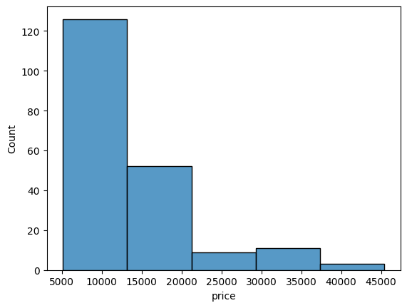
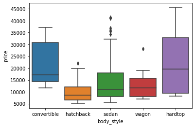

# matplotlib & seaborn

```python
import matplotlib.pyplot as plt
import seaborn as sns

# if desired, also tell python to display the charts inline 
%matplotlib inline
```

`matplotlib` is for basic charts, `seaborn` is able to handle more complex charts and it builds on top of `matplotlib`, so it requires that to be imported too.

## Histogram

A histogram is a univariate plot which helps us understand  the distribution of a continuous numerical variable. It breaks the range of continuous variables into an interval of equal length and then counts the number of observations in each interval.

```python
# load some data, assume it's cars info and has a price column
#df = pd.read_csv('/path/to/file')

# if we want to customize, we'll use 'matplotlib' properties
plt.title('Histogram:Price')
plt.xlim(1000, 3000) # limits between 1000 and 3000 for the x axis
plt.xlabel('Price')
plt.ylabel('Count')

# histoplot for the 'price' column. It uses above settings and uses blue to drow the bars. It will group all data in 5 groups/bins/bars and each bin will be 200px wide. It will show the kernel density estimation curve
sns.histplot(data=df, x='price', color='blue', bins=5, binwidth=200, kde=True)
```
It will look something like:


### Subplots

When you want to split the data and show several histograms, you could use subplots

```python
g = sns.FacetGrid(df, col="body_style")
g.map(sns.histoplot, "price")
```
It would look a bit like this:


## Boxplot
Shows the distribution of numerical data and skewness through displaying the data quartiles

```python
sns.boxplot(data=df, x='curb_weight')
```
Looks a bit like:


```python
# or on both axis
sns.boxplot(data=df, x='body_style', y='price')
```
It will look like:



## Bar Graph

Used to show the counts of observations in each bin (or level or group) of categorical variable using bars

