# Visualisation

| Type       | X Variable                       | Y Variable  | Purpose of analysis                                                          | Type of chart                | How it looks                                                                                                                                         |
|------------|----------------------------------|-------------|------------------------------------------------------------------------------|------------------------------|------------------------------------------------------------------------------------------------------------------------------------------------------|
| Univariate | Continuous                       | -           | How the values on the X variable are distributed?                            | Histogram, Distribution plot | Histogram<br/> 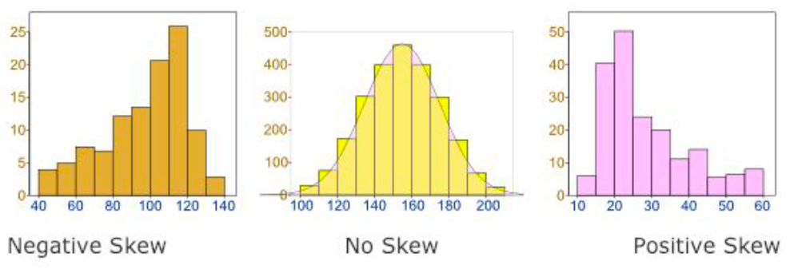 <br/>Distribution plot for car horsepower.<br/>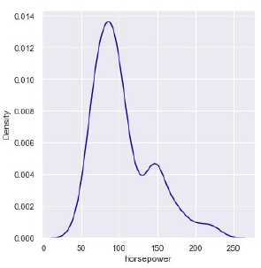                      |
| Univariate | Categorical                      | -           | What is the count of observations in each category of X variable?            | Count plot                   | Count plot for degree of students <br/>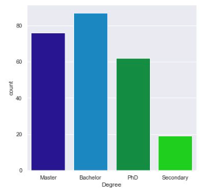                                                                       |
| Bivariate  | Continuous                       | Continuous  | How Y is correlated to X?                                                    | Scatter plot                 | Scatter plot restaurant bill vs tip <br/>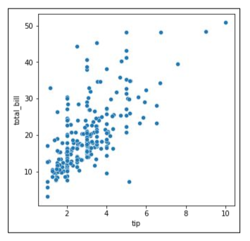                                                                 |
| Bivariate  | Time related (months, hours etc) | Continuous  | How Y changes over time?                                                     | Line plot                    | Line plot of sales over a 10 days period <br/>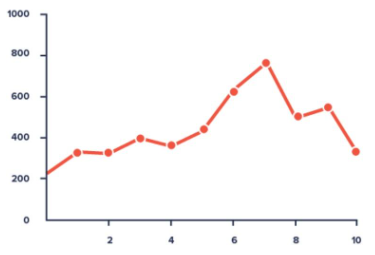                                                                  |
| Bivariate  | Continuous                       | Categorical | How range of X varies for various category levels                            | Box plot, Swarm plot         | Box plot of tip by meal time<br/>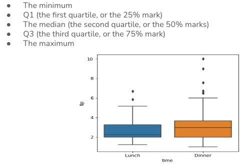 <br/>  Swarm plot tips per week day <br/>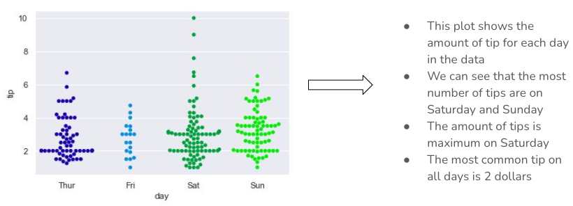 |
| Bivariate  | Categorical                      | Categorical | What is the number of % of records of X which falls under each category of Y | Stacked bar plot             | Smokers/non-smokers vs fitness level <br/> 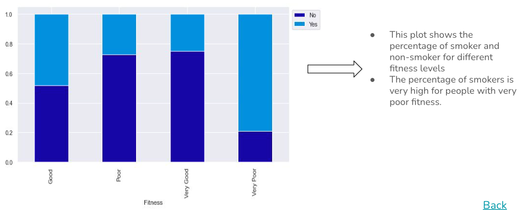                                                               |

| Type         | Variables                | Purpose of analysis                                                      | Type of chart | How it looks                          |
|--------------|--------------------------|--------------------------------------------------------------------------|---------------|---------------------------------------|
| Multivariate | Continuous (more than 2) | How to visualize relationshipo across multiple combination of variables? | Pair plot     | 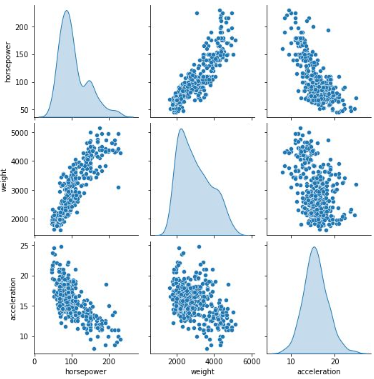 |
| Multivariate | Continuous(more than 2)  | How to visualize the spread of values in the data with color-encoding?   | Heatmap       | 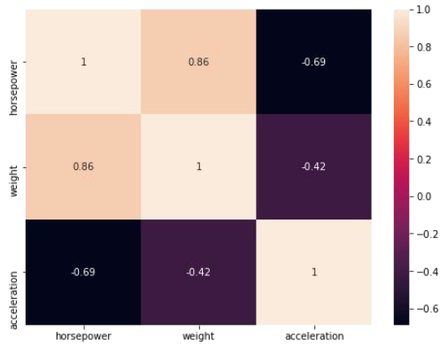   |

## Libraries - matplotlib & seaborn
`matplotlib` is for basic charts, `seaborn` is able to handle more complex charts and it builds on top of `matplotlib`, so it requires that to be imported too.

Some important `matplotlib` functions: `plot()`, `hist()`, `bar()`, `pie()`, `scatter()`, `text()`, `legend()`, etc.

Some important `seaborn` functions: `displot()`, `boxplot()`, `stripplot()`, `pairplot()`

```python
import matplotlib.pyplot as plt
import seaborn as sns

# if desired, also tell python to display the charts inline 
%matplotlib inline
```

## Histogram

A histogram is a univariate plot which helps us understand  the distribution of a continuous numerical variable. It breaks the range of continuous variables into an interval of equal length and then counts the number of observations in each interval.

```python
# load some data, assume it's cars info and has a price column
#df = pd.read_csv('/path/to/file')

# if we want to customize, we'll use 'matplotlib' properties
plt.title('Histogram:Price')
plt.xlim(1000, 3000) # limits between 1000 and 3000 for the x axis
plt.xlabel('Price')
plt.ylabel('Count')

# histoplot for the 'price' column. It uses above settings and uses blue to drow the bars. It will group all data in 5 groups/bins/bars and each bin will be 200px wide. It will show the kernel density estimation curve
sns.histplot(data=df, x='price', color='blue', bins=5, binwidth=200, kde=True)
```
It will look something like:
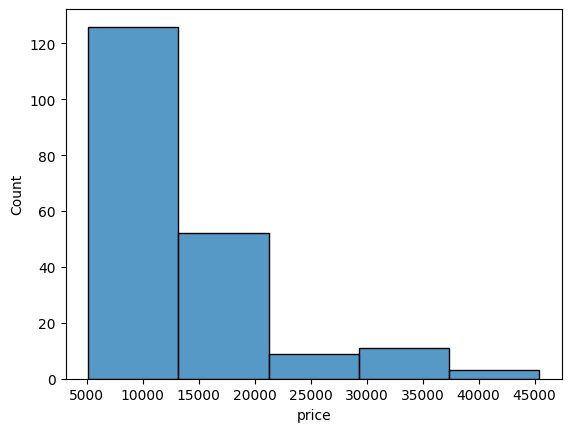

### Subplots

When you want to split the data and show several histograms, you could use subplots

```python
g = sns.FacetGrid(df, col="body_style")
g.map(sns.histoplot, "price")
```
It would look a bit like this:
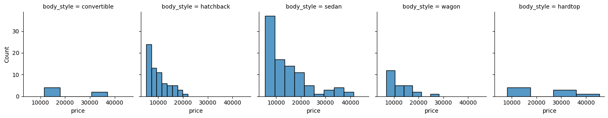

## Boxplot
Shows the distribution of numerical data and skewness through displaying the data quartiles

```python
sns.boxplot(data=df, x='curb_weight')
```
Looks a bit like:
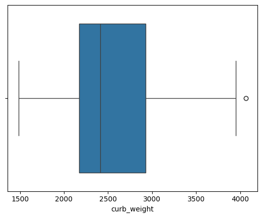

```python
# or on both axis
sns.boxplot(data=df, x='body_style', y='price')
```
It will look like:

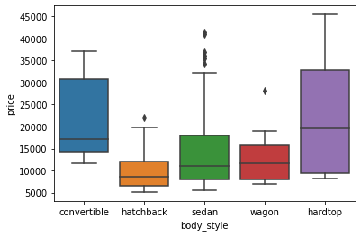

## Bar Graph

Used to show the counts of observations in each bin (or level or group) of categorical variable using bars

