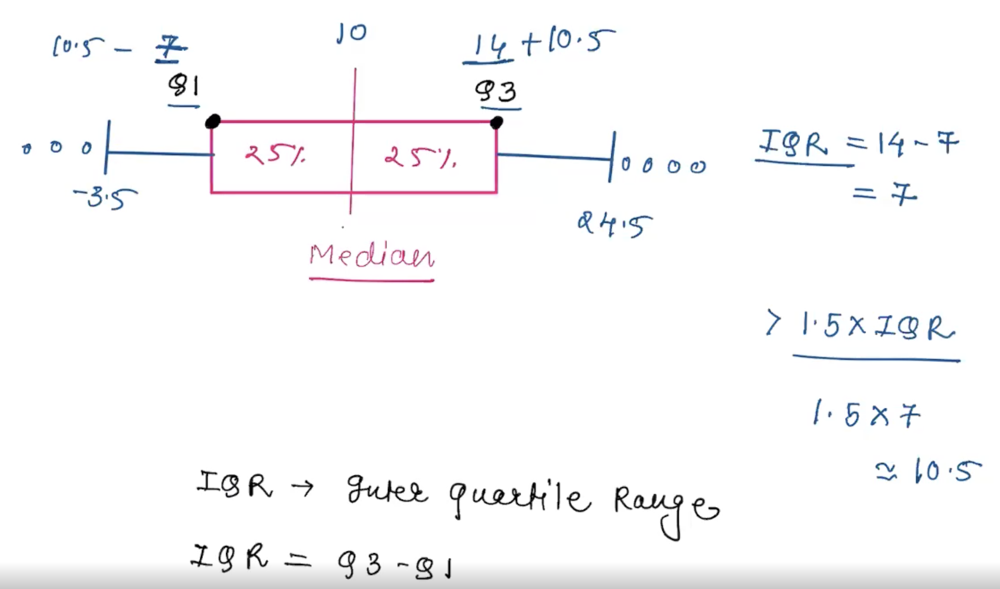

# Statistics concepts and terms

Say we have this set: [ 23, 29, 20, 32, 23, 21, 33, 25 ]
## Mean

Mean is what we'd generally call the arithmetic average. Add all numbers and divide by number of values:

```
mean = sum([ 23, 29, 20, 32, 23, 21, 33, 25 ])/8 -> 25.75
```

> NOTE: Mean is sensitive to extremes, especially in a small sample.

## Median
The median is the number at the middle of the sorted data set. In our case if we order the data set, we get [ 20, 21, 23, <ins>23, 25</ins>, 29, 32, 33 ].

Since it's an even number of values, we have two medians, in our case 23 and 25. We calculate the median in this case as the average of those two values.

```
median = (23 + 25)/2 -> 24
```

> Note: Median isn't sensitive to outliers.

## Mode
The number that shows the most in the data set. In our case, 23 is our mode, as we have it twice in the data set, while all other values are only once.

If data has no repeating value or no value appears more than others, there's no `mode`. Note that includes the case when the values apear more than once, but all apear the same number of times.

If we have several values that have the same number of occurences, we have a `bimodal or multiple modes` data set. We don't average them as we do for multiple medians.

## Range
The range is given by the biggest number minus smallest. For our data above, we have:
```
range = 33 - 20 -> 13
```

## Standard deviation
The average difference between each data sample and the mean. Formula is:

```
Standard deviation = radical (1/n * sum(xi - mean))^2)
```

# Outliers

In many, though not all, cases, to be able to extract relevant information applicable to most of your data, you need to remove the outliers before processing it.

`outlier` = data that is significantly far from the median and from most of your other data. It's those values that schew your `mean`, pulling it to one or the other side of your `median`.

## Removing outliers

To remove outliers, we do the following:
1. calculate the `medium`. Let's say for example that is `10` for our imaginary data sample.
2. take the value that's 25% to the left (`Q1`) and right of the medium (`Q3`). Let's say `Q1 = 7` and `Q3 = 14`
3. calculate the `IQR` (inter quartile ranges). `IQR = Q3 - Q1`. In our imaginary scenario `IQR = 14 - 7 = 7`.
4. multiply `IQR` by `1.5`. For our case, we get `IQR * 1.5 = 7 * 1.5 = 10.5`
5. we consider `outliers` all values that are outside the range [`Q1 - IQR*1.5`, `Q3 + IQR*1.5`]. So in our case, anything that's smaller than `Q1 - IQR*1.5 = 7 - 10.5 = -3.5`, and anything bigger than `Q3 + IQR*1.5 = 14 + 10.5 = 24.5`, will be removed from the data set.

An image representation of the above steps:

