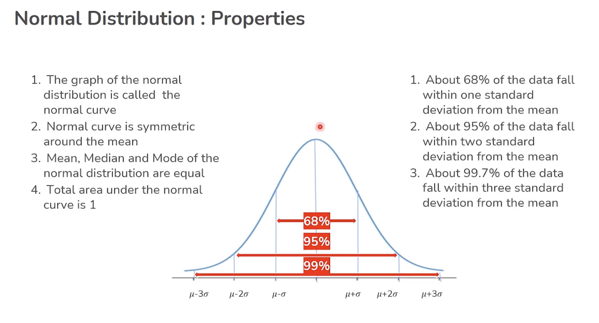
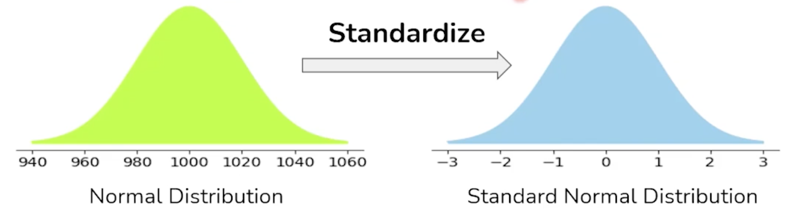

# Distributions
Types of distributions

## Bernoulli
It's either successful or not. 

> E.g. has a specific adult ever posted a video online?

```
 x = 1 (success/yes), with prob p
 x = 0 (fail/no), with prob 1-p
 ```

A Bernoulli distribution is a special case of Binomial Distribution with a single trial.

## Binomial
Counts the total bernoulli variables values from a batch of data. E.g. how many drugs have worked on customers from a batch?

> Say we have 25 adults. We ask them if they posted a video or not. We can count how many have ever posted a video.
>
> Say `X` is the number of adults who ever posted a video. X coresponds to the binomial distribution.

$$P(X = x) = p^x(1-p)^{n-x}$$
Assumptions for binomial, for the above formula to work:
- number of trials (n) is fixed
- each trial is independent of the other trials
- the are only two possible outcomes for each trial
the probability of the success (p) is the same for each trial

> If we want to calculate the probability of `X` to be a specific value, say 10, we have:
$P(X = 10) = p^{10}(1-p)^{25-10}$
> 
> If let's say the probability of success is 0.3, then $P(X = 10) = 0.3^{10}0.7^{15} = 0.0000059049 * 0.004747561509943 = 2.8033876e-8 $. Pretty low probability.

## Uniform
All probabilities are the same. It's equal probable for the variable to take any value from the range of possible values. E.g. the probability of a number to be picked for a lotery game. It's theoretically the same. Or of a number to come on a dice etc.

### Descrete uniform

Limited number of options/results.
> e.g. month of the year (can be one of 12)

### Continuous uniform
A range of unlimited possible options/results.

> e.g. tomorrow's temperature (can be any number value, some having higher probability)

Here's a comparison between discrete and continuous variables:
| Discrete Variable                                                                            | Continuous Variable           |
| --------------------------------------------------------------------| -------------------------------------------------------------------------------------------- |
| Takes particular countable values (i.e. integers)                  | Takes any measured value within a given range (i.e. floats). |
| Discrete data is information that has noticeable gaps between values.                                     | Continuous data is information that occurs in a continuous series.    |
| Discrete data is made up of discrete or distinct values.                                  | Directly in opposition, continuous data includes any value that falls inside a range. |
| Discrete data can be counted.                                          | Continuous data is quantifiable.|
| Bar graphs are a visual representation of discrete data.   | Continuous data are graphically represented using a histogram.|
| For discrete data, a classification like 10-19, 20-29,…, etc., are non-overlapping or mutually inclusive. | For continuous data, classifications such as 10-20, 20-30, etc., overlap or are mutually exclusive.           |
| The discrete function graph exhibits a distinct point that is nonetheless disconnected.                   | A broken line connects the points on a continuous function graph.                                             |
| Examples of frequent discrete data include the number of students, children, shoe size, and so forth.     | Some common continuous data types are height, weight, time, temperature, age, etc.                            |

## Normal
Logaritmic scale (Bell curve). E.g. income distribution of a developed country is generally so. Few rich, few poor, many middle.

Takes two parameters: `mean` (miu) and the `standard deviation` (sigma). The values are distributed around the `mean` equally on both sides

Caracteristics:
> 1. `mean`, `median` and `mode` of the normal distribution are equal
> 2. the normal curve is symetric around the `mean`
> 3. the total area under the normal curve is 1
> 4. 100% of the data is under the curve

### Empirical Rule of normal distribution
The `Empirical Rule` says that about 68% of the population is within one standard deviation from the `mean`, about 95% is within 2 standard deviations from the `mean` and about 99% within 3 standard deviations.



### Standard normal distribution
The standard distribution always has a mean of 0 and standard deviation of 1.

To work with normal distributions, we first standardise them. See image below:


We can convert a normal variable `X` to a standard normal variable `Z`, given `mu` is the mean and `sigma` the standard deviation, using:
$$Z =  (X-mu)/sigma$$
Z(Z-Score/Standard score) is the measure of the number of standard deviations above or below the mean (i.e. left and right of it) that data point falls within.

> E.g. if my height has Z-score 1. That means that my height is one standard deviation above average.

```python
import numpy as np
import scipy.stats as stats

from scipy.stats import norm

# probability of data to be less than `x`
norm.cdf(x, mu, sigma)
```

```python
mu = 500 # mean of original popluation is known
sigma = 25
n = 100 # sample size
alpha = 0.95 # error margin allowed is 0.05
confidence_interv = norm.interval(alpha, loc = mu, scale = sigma/np.sqrt(n))
```

## t-distribution
We use the t-distribution when we don't know the standard deviation of the population.

In this case, we estimate the standard distribution and calculate the confidence interval using the t-distribution.

T-distribution uses a new term, compared with the normal distribution:

`degree of freedom` of the estimate = number of independent pieces of information that went into calculating the estimate (of the mean). It is **always** the number of samples used for the Central Limit Theorem, minus one (`n-1`).

```python
mu = 500 # NOTE this is the calculated one based on random samples. It's the mean of the standard distribution of the means of samples - based on Central Limit Theorem
sigma = 25
n = 100 # sample size
alpha = 0.95 # error margin allowed is 0.05
confidence_interv = t.interval(alpha, df = n-1, loc = mu, scale = sigma/np.sqrt(n))
```