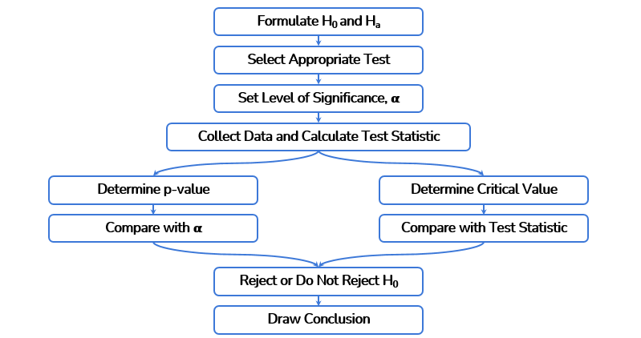

# Hypothesis Testing

## Hyphothesis

Say we have a software that we know to be crashing about every 5 days. We have implmented a new version of the software and think that the version now only crashes less than every 30 days. 

> H0 = status quo, nothing changed. E.g. the new software still crashes every 5 days

> H1 = assumption that something changed. E.g. the new software crashes every 30 days or more

## Errors

||H0 is true|H0 is false|
|---|---|---|
|Reject H0| **Type 1 Error**   ( prob = alpha )  Level of significance|Correct   ( prob = 1 - beta )   Power of the test|
|Fail to reject H0| Correct  ( prob = 1 - alpha )|**Type 2 Error**   ( prob = beta )|

### Type I(1) error
When the hypothesis is correct but we reject it. We assume the status quo is still valid when it isn't.

The probability to get a type 1 error is called the `level of significance` and is noted as `alpha`.

`alpha` is to be decided **before the test** and represents the error margin we consider acceptable, generally for business applications it's `5%`.

> `alpha` depends on the business requirements, NOT the data.

### Type II(2) Error
When the hypothesis is incorrect (status quo is still valid), but we don't reject it (we assume it had changed).

### P-value
The `p-value` is the probability of observing evidence in favor of H0. If `p-value` is small, then we reject H0.

Or put differently `The p-value is a measure of the probability that an observed difference could have occurred just by random chance.`

> When `p-value` >= `alpha`, then we **reject the null hypothesis**. Otherwise we don't.

> In other words, when the observed probability that H0 (status quo) is valid is bigger or equal to the error margin of the population, then we consider the status quo still valid.

> Or when the observed probability that H0 is valid is smaller than the accepted error margin, then there is a chance that H0 is invalid, thus we reject H0(status quo).

## Steps

