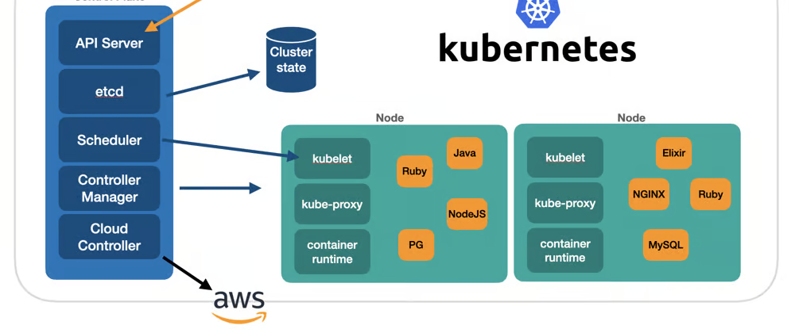

# Scheduler
Handles selecting a node for a workload/pod.

## Filtering
Filters out nodes that can't host the pod. Can be due to:
- not having enough resources
- node might have a taint or affinity, restricting it to specific nodes
- an organiation policy might set specific rules

## Scoring
Assigns a score to nodes.

## Scheduling policies
Allow creating `Predicates` for filtering and `Priorities` for scoring.

## Scheduling Profiles
Allows to configure Plugins that implement different scheduling stages, including: `QueueSort`, `Filter`, `Score`, `Bind`, `Reserve`, `Permit` and others. You can also configure the kube-scheduler to run different profiles.

